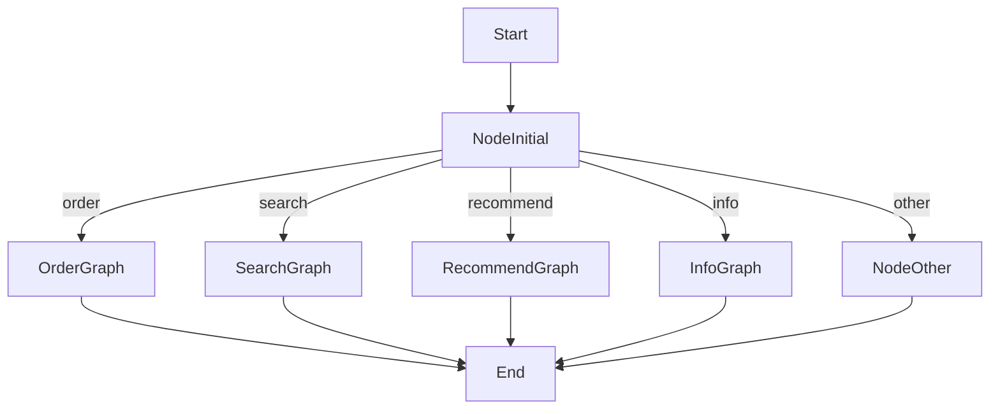

# 🍜 Caht Food: An AI Food Ordering Assistant

A modular, intelligent food assistant built using **LangGraph**, **Chainlit**, **LlamaParse**, **LanceDB**, and **Together AI APIs**. This chatbot can help users find food, manage their orders, ask for recommendations, and retrieve food-related knowledge — all in a seamless conversational interface.

> 🧠 Developed as a course project for **Advanced NLP**, this assistant showcases advanced natural language understanding, retrieval-augmented generation (RAG), agentic reasoning, and stateful interaction.

---

## 🚀 Features

### 🧠 Intelligent Food Assistant
- Handles **multi-turn conversations** about food, ordering, and nutrition.
- Maintains **memory and context** using LangGraph's state management.

### 📚 Knowledge-Aware (RAG)
- Uses **LlamaParse** to parse food-related books.
- Embeds knowledge into **LanceDB** for **fast vector similarity search**.
- If the knowledge is not found, queries the **Tavily Web Search API**.

### 🍽️ Order Management
- Cancel, comment on, or track orders through natural language.
- Matches user input to real order entries via phone number and order ID.

### 🔍 Food Search
- Find food by name, category, location, or restaurant using `food_search()` and fuzzy matching.

### 🤖 Personalized Recommendations
- Uses **Reflection Agent** or **Plan-and-Execute** patterns to recommend dishes based on preferences and interaction history.

### 💬 Interactive Frontend with Chainlit
- Smooth user interface with **live message streaming**.
- Keeps track of message history and user sessions.

---

## 🏗️ Architecture Overview

The chatbot is powered by a **LangGraph graph**, where each major capability is modeled as a separate subgraph. The main entry node routes user inputs conditionally.



---

## 🧰 Tech Stack

| Tool            | Purpose |
|-----------------|---------|
| **LangGraph**   | Agent graph orchestration |
| **Chainlit**    | Frontend & UI layer |
| **Together AI** | Language model inference |
| **LlamaParse**  | Parse PDF books (e.g. food encyclopedias) |
| **LanceDB**     | Vector database for RAG |
| **Tavily API**  | Web search fallback |
| **SQLite**      | Store food & order data |
| **db_manager.py** | Provides wrapper functions to interact with the database |

---

## 📂 Project Structure

```bash
.
├── Codes/
│   └── The New Complete Book of Food.pdf     # A reference food encyclopedia for RAG (parsed using LlamaParse)
│
├── NLP6/                                     # 💡 Main source code directory
│   ├── Untitled10.ipynb                      # Integrated demo notebook (builds and runs the full graph)
│   ├── app.py                                # Entry point for the Chainlit app (main loop and handlers)
│   ├── combined_graph.py                     # Builds the complete LangGraph with routing and state management
│   ├── db_creator.py                         # (Optional) Script to create or seed the food_orders.db SQLite database
│   ├── db_manager.py                         # Contains helper functions like `food_search`, `cancel_order`, etc.
│   ├── food_information_graph.py             # Subgraph handling food info queries (uses RAG + LlamaParse + LanceDB)
│   ├── food_orders.db                        # 📦 Sample SQLite database for foods and orders
│   ├── log.txt                               # Log output from previous runs / debug traces
│   ├── orders_graph.py                       # Subgraph for order-related tasks: cancel, comment, status tracking
│   ├── parser.py                             # Parses and chunks food book content for vector embedding (LlamaParse)
│   ├── seaarch_food_graph.py                 # Subgraph for natural language-based food search (searches the DB)
│   └── suggestor_graph.py                    # Subgraph for food recommendation (Plan-and-Execute or Reflection agent)
│
├── .env                                      # 🔐 Environment variables for API keys (Together AI, Tavily, etc.)
├── README.md                                 # 📘 Full project documentation and usage guide
└── requirements.txt                          # 📦 Python dependencies with approximate versions

```

---

## 🗃️ Database Schema

### `foods`
| Column      | Type   |
|-------------|--------|
| id          | INT    |
| name        | TEXT   |
| price       | REAL   |
| category    | TEXT   |
| restaurant  | TEXT   |

### `food_orders`
| Column      | Type   |
|-------------|--------|
| id          | INT    |
| phone       | TEXT   |
| name        | TEXT   |
| comment     | TEXT   |
| status      | TEXT   | *(e.g., preparation, delivered, canceled)*

---

## 📡 APIs & Tools Used

### Together AI
Used to call LLMs like **Gemini 1.5 Flash** or **GPT-4o-mini**.

### LlamaParse
Used to parse food-related books such as:
- *The New Complete Book of Food*
- *Nutrition Facts Encyclopedia*

### LanceDB
- Stores parsed content in vector form.
- Retrieves chunks relevant to user queries.

### Tavily API
- Fallback for real-time web information if the book database doesn’t have the answer.

---

## ⚙️ Setup & Installation

### 1. Clone the Repo
```bash
git clone https://github.com/your-username/food-chatbot
cd food-chatbot
```

### 2. Install Dependencies
Use Poetry or pip:
```bash
poetry install
# or
pip install -r requirements.txt
```

### 3. Configure Environment
Create a `.env` file:
```env
TOGETHER_API_KEY=your_key
TAVILY_API_KEY=your_key
```

### 4. Run the App
```bash
chainlit run app.py
```

---

## 💬 Example Queries

| Category      | Example |
|---------------|---------|
| 🥗 Food Info   | “Tell me about the health benefits of spinach.” |
| 🔍 Search      | “Show me vegetarian dishes in Tehran.” |
| 📦 Order Track | “Track my order with phone number 09121234567.” |
| ❌ Cancel      | “Cancel my pizza order.” |
| ✍️ Comment     | “Leave a comment for order #15 saying it was delicious.” |
| 🍕 Recommend   | “Suggest something spicy and cheesy.” |

---

## 🧪 Testing

Test intent detection with:
```python
messages = ["I want a spicy food"]
messages = combined_graph.invoke({"messages": messages}, config)
```

If a proper route is found, the system returns a response; if not, it falls back to `node_other`.

---

## 🧠 Known Limitations

- No confirmation prompt before sensitive actions like **order cancellation**
- No persistent memory or summarization yet implemented


---

## 📽️ Demo

A 3–5 minute recorded demo will be included here after development. It will showcase:
- Graph flow (via Mermaid)
- LLM interaction
- Chainlit streaming UI
- Tool calling (cancel order, comment, etc.)

---

## 👨‍💻 Author

- **[Seyyed Reza Moslemi]**

